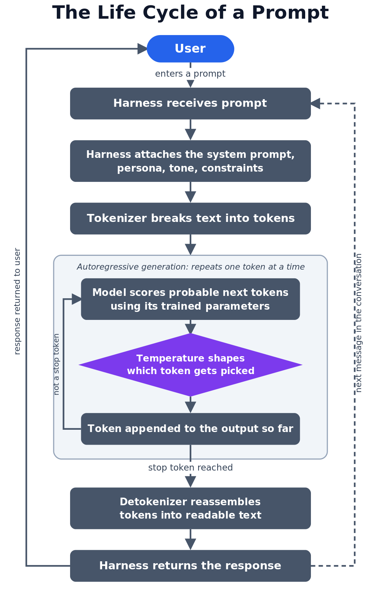

```table-of-contents
title: # Table of Contents
minLevel: 0
maxLevel: 5
```

> [!info] Curious about the full history of AI, from 1956 to present? See [[09 References]].

# Ok, So What IS AI?!?

 Simply put, AI is a vast discipline within computer science aimed at creating systems to perform tasks that we normally think of as requiring human intelligence to perform. AI includes fields like robotics, computer vision, natural language processing (used to translate voice to text and vice versa), expert systems, etc.

In a very real way, the technologies developed for handling and analyzing large quantities of data paved the way for what we currently call artificial intelligence.[^1] 
 
![[AI Venn.png]]

## Where Do LLMs Fit In?

LLMs Are a subset of generative AI. LLM only deal with text, whereas diffusion models deal with imagery. LLMs are probabilistic, which is a fancy way of saying that everything they "create" is generated based on probabilities. How likely it is that you're going to get one answer versus another depends on not just what your prompt was, but also on a lot of math that goes on both inside the model and in the supporting the software that helps you interact with it.[^2]

The current trend with the innovators in LLM development is to follow the "bigger is always better" headspace, training their proprietary models on massive amounts of data from diverse sources. Not surprisingly, most of the LLMs you will find available (ChatGPT, Claude, Copilot, Gemini) are general purpose. You can use them for anything from learning more about a historical concept to finding the perfect rice pudding recipe. You can also do some limited customization (e.g., Custom GPTs), But you are limited to whatever customization features are being provided by the AI provider. More importantly for a lot of people, anytime you use one of these hosted chat bots, you have no control over what happens to your data once you send it across to them.

Regardless, easy access to large language models and their chatbots has popularized artificial intelligence more than ever before.

## Why Go Local?

When I talk to people about why they want to set up and customize a local LLM, the number one reason they cite is privacy. When you host your own LLM, no data ever has to leave your machine, network, or intranet. All of your sensitive files and data remain in your control.

Also, hosting your own local LLM gives you many more options for customizing and fine tuning a model to suit your needs. You can create custom models using a very simple process that we will do ourselves in the Ollama lab. Other options for customization and data handling include Retrieval-Augmented Generation (RAG), or you can train your own model from the ground up. Be forewarned, if you choose to go that route it is a very, *very* deep rabbit hole!

## Fundamental Concepts & Terms

Before you get hands-on, here's the vocabulary chain that explains how a raw model becomes something you can actually talk to. Each concept below builds on the one before it: model, then model types, then what's inside a model, how it got that way, what it actually processes, and finally what sits between you and the model when you use it.

### What is an LLM Model?

At its core, an LLM model is a large file of learned numerical weights, not code in the traditional sense. Those weights encode statistical relationships between tokens (chunks of text) learned from enormous amounts of training data. Given some input text, the model's entire job is to calculate the probability of what token comes next, then repeat that process one token at a time. Everything else you experience when using an LLM, chat behavior, tool use, coding assistance, is built on top of that one core prediction loop.

So what is a "weight," actually? It is just a number the model learned, one of billions. If a picture helps, imagine each as a tiny dial the model can turn. Training is the slow work of adjusting all those numbers, over and over across mountains of text, until the model's guess for the next token lines up with reality. When training stops, those settled numbers *are* the model. That is literally what lands on disk when you `ollama pull` something: a huge file of learned numbers, not a program with logic you can open up and read.

That picture is worth holding onto, because it cuts through a lot of the hype and explains behavior that otherwise looks like either magic or malfunction:

- **There is no database of facts inside.** A model does not look up that Paris is the capital of France. That association is smeared across millions of weights as a statistical tendency, nothing more. It is also why a model will state something dead wrong with total confidence: it is producing a plausible pattern, not reading from a record.
- **You cannot grep it.** There is no line to search for, edit, or delete. If a model absorbed something during training, there is no single spot where that fact lives, so you cannot cleanly reach in and pull it back out. Changing how a model behaves means retraining it or wrapping it, not editing a file.
- **"Bigger" just means more numbers.** That is the parameter count you see stamped on model names, and it is the next thing we will unpack.

### Model Types

Not every model does the same job out of the box. The differences come from what was done to a base model after that raw prediction training. Here are the categories you will actually run into, and what each is tuned for. Nearly everything you pull for this lab is an instruct or chat model; the rest are here so you recognize them in the wild.

**Base (or "foundation") models.** The raw result of prediction training. Hand one a chunk of text and it will keep going in a statistically plausible way, but it has no particular urge to answer questions, follow instructions, or hold a conversation. Handy as a starting point, awkward to talk to. You will rarely pull a pure base model for this lab, or for any other, unless you are training your own model.

**Instruct models.** A base model put through instruction tuning: extra training on piles of examples that pair an instruction with a good response. The payoff is a model that handles a single, standalone request well, things like "summarize this" or "write a regex that matches X." These expect their input phrased as a direct instruction and are often tagged `-instruct`.

**Chat models.** Tuned specifically for holding a conversation, with separate system, user, and assistant roles and a chat template that tracks whose turn it is. They are built to carry context across many messages and to honor a system prompt. Often tagged `-chat`.

**Reasoning (or "thinking") models.** Trained to work a problem step by step, out loud, before landing on an answer. If a model ever streams its scratch work at you under a "Thinking..." header, that is one of these. They shine on problems that need working through, and they are slow or distracting for something that should be a fast, short answer.

**Specialized models.** Everything tuned for a narrow job: code models (trained heavily on source code for completion and generation), embedding models (which do not chat at all, they turn text into vectors of numbers so software can measure how similar two pieces of text are, the engine behind search and RAG), and vision or multimodal models (which can take images as input, not just text).

> [!info] The Instruct/Chat Line is Blurrier than It Looks
> Out in the wild these categories bleed together. Plenty of models tagged `-instruct` chat perfectly well across multiple turns, and a lot of "chat" models are really just instruct models with a conversation template bolted on. On top of that, Ollama automatically applies whatever prompt template a model ships with, so you almost never set this by hand. Treat these labels as "what the model was optimized for," not hard rules, and do not lose sleep over which bucket a given model falls into.

### Open Weights vs. Proprietary Models

One more split, and it runs on a different axis from everything above. The types above are about *how* a model was tuned. This one is about *who controls it* and whether you can run it yourself.

**Models with open weights**, like Llama, Qwen, Mistral, and Gemma, and basically everything you pull in this lab, publish the actual weight files. You can download them, run them on your own hardware, poke at them, fine tune them, and use them with nobody watching over your shoulder. That is the whole reason this workshop is even possible.

**Proprietary or hosted models**, like GPT-4, Claude, and Gemini, keep their weights locked on the vendor's servers. You reach them only through an API or a web app, you cannot run them locally, and every prompt you send leaves your control. That is the exact tradeoff this lesson opened with back in "Why Go Local."

Two cautions about the word "open." First, "open weights" is not the same as "open source." You get the finished weight file, not the training data or the code that produced it, so you generally cannot reproduce the model yourself. Second, most of these models ship under licenses with real strings attached, usage restrictions and sometimes limits on commercial scale, so "open" does not automatically mean "do whatever you want with it."

### Parameters and Model Size

A model's parameters are the weights described above, the internal values it learned during training. Model size is usually marketed as a parameter count: 7B, 13B, 33B, and so on, where B stands for billions of parameters. More parameters generally means the model captured more nuance during training, but it also means a bigger memory footprint at run time. This is why model size drives the RAM requirements you'll see in the Ollama lab; you're not just loading a program, you're loading billions of numbers into memory.

### How Models are Trained

Training a base model means showing it a massive amount of text and repeatedly adjusting its parameters so its next-token predictions get closer to what actually appears in the data. This happens over enormous numbers of iterations and consumes serious compute, which is most of why frontier models are expensive to build. Instruction tuning, mentioned above, is a second, much smaller training pass on top of that foundation. You won't be training a model from scratch in this workshop, but knowing that training is where a model's knowledge and behavior get baked in explains why you can't just ask a model to "forget" something it learned, and why customizing a model in the next lab works by adjusting how it responds rather than retraining it.

### Tokens

Models don't process text word by word, they break it into tokens: chunks of characters that might be a whole word, part of a word, or a punctuation mark. This matters in two different ways, and it's worth keeping them separate.

Model tokens are the linguistic units described above, what the model actually reads and generates internally. A model's context window, how much conversation it can hold onto at once, is measured in these tokens, not words or characters.

Compute tokens are what hosted AI services meter and bill for. When you use ChatGPT, Claude, or Copilot through their APIs, you pay per token processed, input and output both. That's a direct cost that scales with how much you use the service. Run a model locally, as you're doing in this workshop, and that per-token bill disappears; you're paying with your own hardware and electricity instead of a per-request invoice. This is part of the same "why go local" calculus from earlier in this lesson.

### Harness

A raw model only predicts the next token. Everything that makes it feel like a product, a chat window, memory of the conversation so far, the ability to call tools, a command line you type into, is provided by software wrapped around the model. That wrapping is often called a "harness". Ollama itself is a harness: it loads a model's weights, exposes them through a local API, and gives you a CLI to talk to it. Later in this workshop you'll put different harnesses in front of the same served model: a terminal client, a TUI (a text user interface, meaning menus and panels you drive with the keyboard right inside the terminal), and a web interface, each offering a different way to reach the same underlying model.

#### The Life Cycle of a Prompt

Here's how the pieces above fit together in practice, the full journey a single prompt takes, from you, through everything in between, and back.



### System Prompt

A system prompt is a standing instruction that shapes how a model behaves: its persona, tone, or constraints, set once by whoever configures the harness rather than repeated by the user in every message. When you build a custom model with a Modelfile in the Ollama lab, the SYSTEM block is exactly this: instructions the harness feeds the model before your conversation ever starts.

### Temperature

Temperature controls how predictable versus creative a model's output is. Low temperature produces more focused, consistent answers; high temperature produces more varied, unexpected ones. You'll set this directly as a parameter when building a custom model with a Modelfile.


[^1]: I personally hate the term "artificial intelligence" because, 1) since these are digital tools it should be obvious that they're artificial, and 2) the reality is that they are anything but intelligent. 

[^2]: As previously mentioned, if you want to get really deep into the weeds about the data science of how LLMs work, check out *[AI for Cybersecurity Professionals with Joff Thyer and Derek Banks](https://www.antisyphontraining.com/product/ai-for-cybersecurity-professionals-with-joff-thyer-and-derek-banks/)*.

---

< Previous - [[00 About This Workshop]] | [[02 Setting Up Your VMs]] - Next > 


