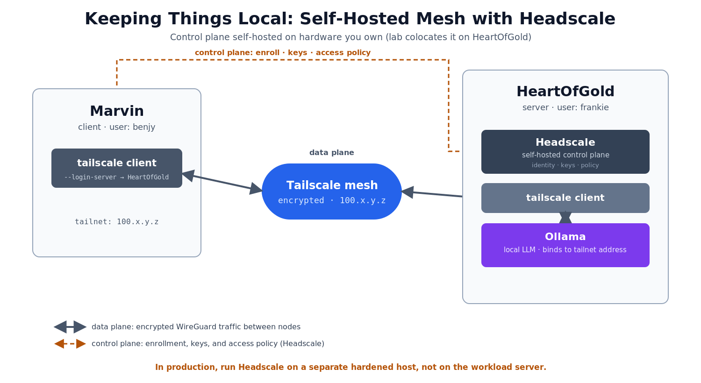

```table-of-contents
title: # Table of Contents
minLevel: 0
maxLevel: 3
```

# Self-Hosting the Mesh with Headscale

[[05 Tailscale Mesh Networking]] got you a working mesh in a couple of minutes by leaning on Tailscale's hosted coordination server. That is the fast path, and for most of this lab it is the right one. This lesson is the alternative for when you do not want to depend on anyone else's server at all: you run the coordination server yourself, on hardware you control, using [Headscale](https://headscale.net/).

> [!info] This Lesson is Optional
> Nothing later in the workshop requires Headscale. If you completed the Tailscale mesh in lesson 05, you already have everything [[06 Locking It Down with nginx]] needs. Come here when you want the whole stack, control plane included, inside your own perimeter.

## Tailscale or Headscale: Which and When

Both give you the same encrypted WireGuard mesh, the same `tailscale` client, and the same `100.x.y.z` addressing. The difference is one thing only: who runs the coordination server, the control plane that handles identity, key exchange, and access policy.

With **Tailscale**, that control plane is Tailscale's hosted service. It is audited, well run, and it never sees your traffic, but it is still a third party you depend on to be reachable and trustworthy. Choose it when you want to be meshed in two minutes, and on a red team engagement when you just need durable encrypted access back to a foothold and do not want to stand up infrastructure.

With **Headscale**, you run the control plane yourself. It is an open-source reimplementation of Tailscale's coordination server, and standard Tailscale clients connect to it instead of to Tailscale's cloud. Choose it when the control plane itself has to live inside your network: an internal service on gear you own, a stricter trust boundary, an environment with no outbound dependency on an external provider, or anywhere "no third-party dependencies" has to be true.

> [!note] Same Security, Different Trust Boundary
> Headscale and Tailscale use the same WireGuard cryptography, so neither is more secure on the wire. Headscale is the more sovereign choice because it moves the last third party, the coordination server, onto hardware you control. The question is where your trust boundary sits, not which one encrypts better.

## What Stays the Same

Almost everything from lesson 05 carries over:

- The client is identical. Both VMs still run the same `tailscale` binary you already installed.
- Exposing Ollama on the mesh is unchanged. Once the VMs are meshed, the "Exposing Ollama on the Mesh" and "Verifying the Connection" steps in [[05 Tailscale Mesh Networking]] work as written.
- The addressing is the same `100.x.y.z` range, so nothing downstream has to change.

Only two things change: there is no Tailscale account, and the client points at your own server. This lesson covers just those pieces.

## Where the Control Plane Lives

In this lab HeartOfGold runs both roles. It keeps running Ollama and also runs Headscale, so the coordination server sits on the same box you already control. Marvin stays a pure client. Both VMs then enroll into the tailnet that HeartOfGold coordinates.



> [!warning] The Lab Colocates; Production Should Not
> Running Headscale on HeartOfGold is a lab simplification to avoid standing up a third VM. In a real deployment, put Headscale on its own dedicated, minimal, hardened host, separate from the workload. The control plane holds identity, keys, and the access policy for your entire tailnet, so if the workload host is compromised you do not want the coordination server to fall with it. Separating them contains a compromise, lets you patch or reboot the LLM box without breaking enrollment for every node, and keeps the control plane's attack surface small and distinct.

## Installing Headscale on HeartOfGold

> [!note]
> On the lab VMs Headscale is already installed and configured, so you can skim this section and pick up at "Creating a User." It is here so you can reproduce the setup on your own hardware later.

The Debian package is the recommended install on Ubuntu. It creates a service account, drops a default config, and ships a systemd unit. On HeartOfGold, download the latest release for your architecture and install it:

> [!hog] HeartOfGold · frankie
> ```shell
> HEADSCALE_VERSION=""   # latest version from the releases page, e.g. 0.29.2, no "v" prefix
> HEADSCALE_ARCH="amd64" # your architecture
> wget --output-document=headscale.deb \
>   "https://github.com/juanfont/headscale/releases/download/v${HEADSCALE_VERSION}/headscale_${HEADSCALE_VERSION}_linux_${HEADSCALE_ARCH}.deb"
> sudo apt install ./headscale.deb
> ```

The current releases are on the [Headscale releases page](https://github.com/juanfont/headscale/releases). Supported systems are Ubuntu 22.04 or newer and Debian 12 or newer.

## Configuring the Server

Headscale reads its configuration from `/etc/headscale/config.yaml`. The one setting you must get right is `server_url`, the address clients will connect to. Because Marvin reaches HeartOfGold over the lab network, set this to HeartOfGold's LAN address and port `8080`:

> [!hog] HeartOfGold · frankie
> ```shell
> sudo nano /etc/headscale/config.yaml
> ```

```yaml
server_url: http://<HEARTOFGOLD_LAN_IP>:8080
listen_addr: 0.0.0.0:8080
```

If you want short MagicDNS names to resolve, confirm the DNS section has MagicDNS enabled and a base domain set:

```yaml
dns:
  magic_dns: true
  base_domain: hog.internal
```

Then start the service and confirm it is healthy:

> [!hog] HeartOfGold · frankie
> ```shell
> sudo systemctl enable --now headscale
> sudo systemctl status headscale
> ```

## Creating a User

A node has to belong to a user, so create one for the tailnet. `benjy` matches the client user this lab uses on Marvin, but any name works:

> [!hog] HeartOfGold · frankie
> ```shell
> sudo headscale users create benjy
> ```

Confirm it exists:

> [!hog] HeartOfGold · frankie
> ```shell
> sudo headscale users list
> ```

## Generating a Pre-Auth Key

Rather than register each node interactively, mint a pre-authenticated key and use it to join both VMs non-interactively. Recent Headscale takes the user's numeric ID, which you can read from `headscale users list`:

> [!hog] HeartOfGold · frankie
> ```shell
> sudo headscale preauthkeys create --user <USER_ID> --reusable --expiration 1h
> ```

`--reusable` lets the one key enroll both VMs; the short expiration keeps it from lingering. Copy the key it prints.

## Joining Both VMs

Now bring up the `tailscale` client on each VM, pointing it at your Headscale server instead of Tailscale's, and hand it the key. Run this on **both** HeartOfGold and Marvin:

> [!bothvms] Both VMs
> ```shell
> sudo tailscale up \
>   --login-server http://<HEARTOFGOLD_LAN_IP>:8080 \
>   --authkey <YOUR_PREAUTH_KEY>
> ```

The `--login-server` flag makes the standard Tailscale client trust your coordination server instead of the hosted one.

> [!tip] Enrolling Your Own Machines Later
> The same command joins a laptop or phone to your tailnet, as long as that device can reach `<HEARTOFGOLD_LAN_IP>:8080`. Generate a fresh key for each batch of devices and keep the expirations short.

## Verifying the Mesh

From the server, list the nodes Headscale now coordinates:

> [!hog] HeartOfGold · frankie
> ```shell
> sudo headscale nodes list
> ```

You should see both HeartOfGold and Marvin with their `100.x.y.z` addresses. On either VM, the client's own view should agree:

> [!bothvms] Both VMs
> ```shell
> tailscale status
> ```

From here you are back on the lesson 05 path. Return to [[05 Tailscale Mesh Networking]] and follow "Exposing Ollama on the Mesh" and "Verifying the Connection" as written, using HeartOfGold's tailnet address from `tailscale ip -4`.

> [!info] A Note on MagicDNS Names
> Tailscale's hosted MagicDNS resolves a bare `heartofgold`. Under Headscale, names resolve as a fully qualified name using the `base_domain` you set, for example `heartofgold.hog.internal`. If a bare name does not resolve, use the FQDN or the tailnet IP from `tailscale ip -4`; the IP always works.

## Opsec and Sovereignty

Self-hosting the control plane removes the last third party from the "keep it local" promise. There is no external coordination server logging device names, keys, or connection times, because that server is now yours. On an engagement where an outbound dependency on a third-party provider is itself a risk, or where the rules of engagement forbid routing any metadata through outside infrastructure, Headscale keeps the entire mesh, control plane and all, inside the boundary you already own.

> [!warning] You Now Own the Uptime
> Removing the third party means you take on its job. If the Headscale host is down or unreachable, new nodes cannot enroll and existing keys cannot be re-authed. Existing tunnels keep running, but treat the control-plane host as infrastructure you are responsible for keeping alive.

> [!checkpoint] Checkpoint
> You have finished this lesson when all of the boxes below are ticked. Work through them in order, and if one does not hold, go back to the section it came from before moving on. Tick each box as you confirm it.
>
> - [ ] Headscale is running on HeartOfGold (`systemctl status headscale` reports active)
> - [ ] `sudo headscale nodes list` shows both HeartOfGold and Marvin with `100.x.y.z` addresses
> - [ ] `tailscale status` on each VM agrees with that list
> - [ ] From Marvin you can reach HeartOfGold over the self-hosted mesh, by tailnet IP or FQDN

---

> [!nav]
> [[05 Tailscale Mesh Networking]]
>
> [[06 Locking It Down with nginx]]
