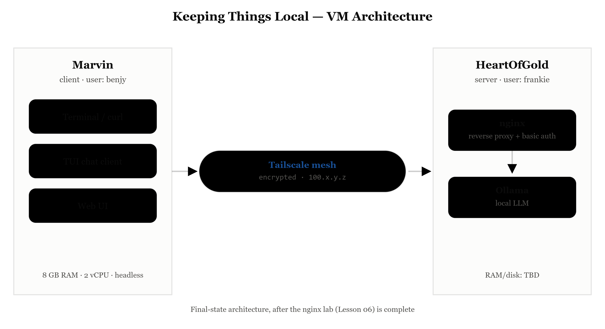

# Keeping Things Local: Build It, Mesh It, Lock It

**A hands-on workshop for building a private, team-accessible AI service on hardware you control.**

[](https://creativecommons.org/licenses/by/4.0/)

Presented at the **Antisyphon AI Summit, August 2026** by Bronwen Aker (Corvus).

---

## About This Workshop

Large language models are powerful tools, but they come with a tradeoff: send your data to OpenAI, Anthropic, Microsoft, or Google to get results. For security practitioners, penetration testers, and anyone handling sensitive or client data, that's a problem.

This four-hour, hands-on workshop shows you how to build a working alternative: a private AI service running entirely on hardware you control, accessible securely across your team or engagement, with authentication built in. No data leaves your environment. No third-party dependencies. Just your AI, your rules.

You start with Ollama on a single VM, expand to a two-VM setup connected over an encrypted mesh network, then lock it down with authentication. Each section builds on the previous one.

## What You'll Build



A complete service layer around a local LLM: a server VM running Ollama, a client VM that reaches it across an encrypted Tailscale mesh, and an nginx reverse proxy enforcing authentication in front of it all.

## What You'll Learn

By the end of the workshop, you will be able to:

- Install and configure Ollama on Linux and manage local models from the command line
- Configure Ollama to listen on the network so other systems can use it
- Customize model behavior with Modelfiles to build purpose-specific assistants for your workflows
- Build an encrypted mesh network with Tailscale and connect multiple machines to it
- Self-host the mesh's control plane with Headscale to keep the entire stack on hardware you control (optional module)
- Put an nginx reverse proxy with basic authentication in front of Ollama to control who can reach it
- Explain the data sovereignty case for local AI and the attack surface you take on when you expose an LLM service

## Who This Is For

Security practitioners, sysadmins, and technical folks who want AI capability without shipping sensitive data to a third party. If you handle client data, work under confidentiality constraints, or just want to know exactly where your prompts go, this workshop is for you. It's a strong fit for:

- **Red teamers and penetration testers**, who get a private AI that won't leak client data during an engagement, plus mesh networking they can use on assessments
- **Consultants and MSSP staff** who handle multiple clients' sensitive data under contract
- **Anyone in a regulated industry** (healthcare, legal, finance, government) where data sovereignty is a compliance requirement, not a preference

It's also a fit for anyone who has played with a local model on one machine and wants to turn it into a real service their team can use.

**Skill level: Intermediate.** You should be comfortable in a Linux terminal and already know your way around frontier LLMs and basic AI concepts.

## Prerequisites

- Working familiarity with frontier LLMs (ChatGPT, Claude, Gemini, or similar) and basic AI/LLM concepts. You should know what a prompt is, what a model is, and what a system prompt does
- Comfort with the Linux command line (editing files, installing packages, basic troubleshooting)
- Comfort running privileged commands (`sudo`) to install packages and edit system config
- Basic web/HTTP literacy (the idea of clients, servers, ports, and requests)
- Basic familiarity with virtual machines (importing and running a VM in VMware)
- Helpful but not required: familiarity with networking concepts (IP addresses, ports, proxies)

No prior experience with Ollama, Tailscale, or nginx is needed. Every tool is introduced from scratch.

## System Requirements

VMware and the lab VMs are provided. You need a laptop that can run two virtual machines at the same time:

- 16 GB RAM minimum (24 GB or more recommended)
- 60 GB free disk space
- CPU with virtualization support enabled in BIOS/UEFI
- Reliable internet connection (required for model downloads and Tailscale)

## Lab VMs and Large Files

The VMware lab VMs, pre-loaded models, and demo videos are **distributed separately** from this repository because of their size. They are provided for download before class, along with import instructions and credentials.

> **Download and import everything ahead of time.** The model files are large and take time to download and extract.

*(Download link to be provided by the workshop host.)*

Setting up a free Tailscale account is part of the lab, so no advance signup is needed.

## Viewing the Lab Manual

The lab manual is written as an [Obsidian](https://obsidian.md/) vault, and this repository is that vault. For the experience it was designed for, open the repository folder in Obsidian rather than reading the files on GitHub. In Obsidian the manual renders as intended, with its callouts, the labels showing which VM each command runs on, the checkpoints at the end of each lesson, and the Previous and Next navigation.

To get the full styling, enable the bundled CSS snippets under Settings > Appearance > CSS snippets. The Markdown stays perfectly readable on GitHub or in any plain Markdown viewer, just without the Obsidian formatting.

## Workshop Modules

The lab manual is organized into sequential modules. Each builds on the last.

| #   | Module                                                                                                     | What it covers                                                                                        |
| --- | ---------------------------------------------------------------------------------------------------------- | ----------------------------------------------------------------------------------------------------- |
| 00  | [About This Workshop](Lab%20Manual/00%20About%20This%20Workshop.md)                                        | Orientation, tools, and how the labs fit together                                                     |
| 01  | [What is an LLM](Lab%20Manual/01%20What%20is%20an%20LLM.md)                                                | LLM history, capabilities, limitations, and core terminology                                          |
| 02  | [Setting Up Your VMs](Lab%20Manual/02%20Setting%20Up%20Your%20VMs.md)                                      | Import and configure the server and client VMs; basic networking                                      |
| 03  | [Working with Ollama](Lab%20Manual/03%20Working%20with%20Ollama.md)                                        | Install Ollama, pull and run models, and the commands you'll use most                                 |
| 04  | [Model Customization with Modelfiles](Lab%20Manual/04%20Model%20Customization%20with%20Modelfiles.md)      | Build purpose-specific assistants with system prompts and parameter tuning                            |
| 05  | [Tailscale Mesh Networking](Lab%20Manual/05%20Tailscale%20Mesh%20Networking.md)                            | Stand up an encrypted mesh and reach Ollama across it                                                 |
| 05b | [Self-Hosting the Mesh with Headscale](Lab%20Manual/05b%20Self-Hosting%20the%20Mesh%20with%20Headscale.md) | *Optional.* Run the mesh's control plane yourself with Headscale instead of Tailscale's hosted server |
| 06  | [Locking It Down with nginx](Lab%20Manual/06%20Locking%20It%20Down%20with%20nginx.md)                      | Add an nginx reverse proxy with authentication in front of Ollama                                     |
| 07  | [Putting It Through Its Paces](Lab%20Manual/07%20Putting%20It%20Through%20Its%20Paces.md)                  | Reach the model three ways (terminal, TUI, web UI), then use it on sensitive-data and red team tasks  |
| 08  | [Wrap Up and Loose Ends](Lab%20Manual/08%20Wrap%20Up%20and%20Loose%20Ends.md)                                            | Data sovereignty, attack surface, and hardening for production                                        |
| 09  | [References](Lab%20Manual/09%20References.md)                                                              | Supplemental material, including the full history of AI                                               |

## Repository Layout

```
.
├── README.md                 This file
├── LICENSE                   CC BY 4.0
├── Lab Manual/               The workshop modules (00–09) and images
│   └── assets/               Diagrams and screenshots used in the manual
├── assets/                   Architecture and login diagrams
└── model files/              Example Modelfiles (daffy, quizmaker)
```

## Tools Used

- **[Ollama](https://ollama.com/)**: local LLM runtime
- **[Tailscale](https://tailscale.com/)**: encrypted mesh networking
- **[Headscale](https://headscale.net/)**: self-hosted Tailscale control server (optional module)
- **[nginx](https://nginx.org/)**: reverse proxy with basic authentication
- **VMware Workstation / Fusion**: virtualization for the two lab VMs

## License

This work is licensed under the [Creative Commons Attribution 4.0 International License (CC BY 4.0)](https://creativecommons.org/licenses/by/4.0/). You are free to share and adapt this material for any purpose, including commercially, provided you give appropriate credit, link to the license, and indicate if changes were made. See [LICENSE](LICENSE) for the full text.

## Author

**Bronwen Aker**, *Corvus, The Cybrarian*
