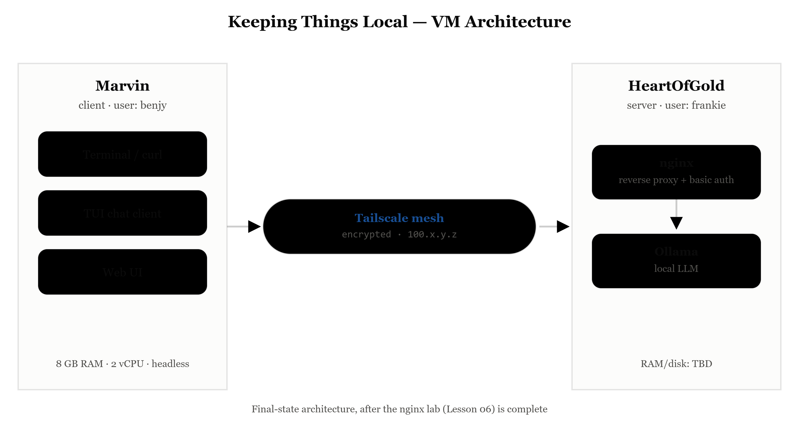

# Keeping Things Local: Build It, Mesh It, Lock It

**A hands-on workshop for building a private, team-accessible AI service on hardware you control.**

[](https://creativecommons.org/licenses/by/4.0/)

Presented at the **Antisyphon AI Summit, August 2026** by Bronwen Aker (Corvus).

---

## About This Workshop

Large language models are powerful tools, but they come with a tradeoff: send your data to OpenAI, Anthropic, Microsoft, or Google to get results. For security practitioners, penetration testers, and anyone handling sensitive or client data, that's a problem.

This four-hour, hands-on workshop shows you how to build a working alternative: a private AI service running in an environment you control, accessible securely across your team or engagement, with authentication built in. Your prompts and model responses stay inside the lab environment instead of being sent to a hosted AI provider. You choose how much of the surrounding infrastructure to operate yourself.

You start with Ollama on a single VM, expand to a two-VM setup connected over an encrypted mesh network, then lock it down with authentication. Each section builds on the previous one.

## What You'll Build

A complete service layer around a local LLM: a server VM running Ollama, a client VM that reaches it across an encrypted Tailscale mesh, and an nginx reverse proxy enforcing authentication in front of it all. You will use the finished service from both the command line and a browser-based chat interface, then inspect the access logs to see how those callers appear to the server.



## What You'll Learn

By the end of the workshop, you will be able to:

- Install and configure Ollama on Linux and manage local models from the command line
- Configure Ollama to listen on the network so other systems can use it
- Customize model behavior with Modelfiles to build purpose-specific assistants for your workflows
- Explain the roles of the model, harness, system prompt, and model parameters in a working AI service
- Build an encrypted mesh network with Tailscale and connect multiple machines to it
- Self-host the mesh's control plane with Headscale to keep the entire stack on hardware you control (optional module)
- Put an nginx reverse proxy with basic authentication in front of Ollama to control who can reach it
- Use separate credentials for command-line and web clients, and identify each caller in nginx's access log
- Reach the same protected model through both `curl` and Open WebUI
- Distinguish the security roles of encryption, authentication, and authorization, including the limits of basic authentication
- Explain the data sovereignty case for local AI and the attack surface you take on when you expose an LLM service

## Who This Is For

Security practitioners, sysadmins, and technical folks who want AI capability without shipping sensitive data to a third party. If you handle client data, work under confidentiality constraints, or just want to know exactly where your prompts go, this workshop is for you. It's a strong fit for:

- **Red teamers and penetration testers**, who get a private AI that won't leak client data during an engagement, plus mesh networking they can use on assessments
- **Consultants and MSSP staff** who handle multiple clients' sensitive data under contract
- **Anyone in a regulated industry** (healthcare, legal, finance, government) where data sovereignty is a compliance requirement, not a preference

It's also a fit for anyone who has played with a local model on one machine and wants to turn it into a real service their team can use.

**Skill level: Intermediate.** You should be comfortable in a Linux terminal and already know your way around frontier LLMs and basic AI concepts.

## Prerequisites

- Some familiarity with a hosted AI tool such as ChatGPT, Claude, Gemini, or similar is helpful, but no deep AI or data-science background is required
- Comfort with the Linux command line (editing files, installing packages, basic troubleshooting)
- Comfort running privileged commands (`sudo`) to install packages and edit system config
- Basic web/HTTP literacy (the idea of clients, servers, ports, and requests)
- Basic familiarity with virtual machines (importing and running a VM in VMware)
- Helpful but not required: familiarity with networking concepts (IP addresses, ports, proxies)

No prior experience with Ollama, Tailscale, or nginx is needed. Every tool is introduced from scratch.

## System Requirements

The workshop uses two provided lab VMs. Delivery details may vary; if you are running the VMs locally, the current lab manual uses VMware Workstation Pro or Fusion Pro. Both are free for personal, educational, and commercial use, with no license key required. You can download them from Broadcom, which requires a free Broadcom Support Portal account. See [Lesson 02](Lab%20Manual/02%20Setting%20Up%20Your%20VMs.md) for the current setup instructions.

To run both VMs locally, you need:

- 24 GB RAM minimum (32 GB or more recommended)
- 60 GB free disk space
- CPU with virtualization support enabled in BIOS/UEFI
- Reliable internet connection (required for model downloads and Tailscale)

## Lab VMs and Large Files

The lab VMs, pre-loaded models, and demo videos are **distributed separately** from this repository because of their size. Access instructions and credentials are provided before class. If the VMs are being run locally, download and import instructions are included with the workshop files.

> **If you are running the VMs locally, download and import everything ahead of time.** The model files are large and take time to download and extract.

**[Download the local-VM workshop files from Dropbox](https://www.dropbox.com/scl/fo/ws0q6m0ex4zs7aij9158c/APeV-FmjEznsiUrv2jkdek8?rlkey=a96mi9cgq4hj1686h6fpzsyt9&st=pqt2x9c4&dl=0)**

The same link, along with the current VMware import instructions, is in [Lesson 02](Lab%20Manual/02%20Setting%20Up%20Your%20VMs.md).

Setting up a free Tailscale account is part of the lab, so no advance signup is needed. You can if you want, but you don't have to.

## Viewing the Lab Manual

The lab manual is written as an [Obsidian](https://obsidian.md/) vault, and this repository is that vault. The client VM (Marvin) already has Obsidian installed with the manual loaded and ready to use. To view a separate copy as intended, open the repository folder as a vault in Obsidian instead of reading the files on GitHub or in another Markdown editor. In Obsidian, the manual renders with callouts, labels showing which VM each command runs on, checkpoints, and Previous/Next navigation.

To get the full styling, enable the bundled CSS snippets under *Settings > Appearance > CSS snippets*.

If you don't have Obsidian, the markdown stays perfectly readable on GitHub or in any plain Markdown viewer. The formatting and callouts just won't render as prettily.

## Workshop Modules

The lab manual is organized into sequential modules. Each builds on the last.

| #   | Module                                                                                                     | What it covers                                                                                        |
| --- | ---------------------------------------------------------------------------------------------------------- | ----------------------------------------------------------------------------------------------------- |
| 00  | [About This Workshop](Lab%20Manual/00%20About%20This%20Workshop.md)                                        | Orientation, tools, and how the labs fit together                                                     |
| 01  | [What is an LLM](Lab%20Manual/01%20What%20is%20an%20LLM.md)                                                | Where LLMs fit within AI, why you might run one locally, and the core vocabulary used throughout the workshop |
| 02  | [Setting Up Your VMs](Lab%20Manual/02%20Setting%20Up%20Your%20VMs.md)                                      | Prepare HeartOfGold and Marvin, log in, and open the lab manual in Obsidian                            |
| 03  | [Working with Ollama](Lab%20Manual/03%20Working%20with%20Ollama.md)                                        | Verify Ollama, pull and run models, and learn the commands used throughout the remaining labs         |
| 04  | [Model Customization with Modelfiles](Lab%20Manual/04%20Model%20Customization%20with%20Modelfiles.md)      | Create persona and task models with `FROM`, `PARAMETER`, and `SYSTEM`, without retraining              |
| 05  | [Tailscale Mesh Networking](Lab%20Manual/05%20Tailscale%20Mesh%20Networking.md)                            | Enroll both VMs in an encrypted mesh and reach Ollama from Marvin without exposing it to the wider network |
| 05b | [Self-Hosting the Mesh with Headscale](Lab%20Manual/05b%20Self-Hosting%20the%20Mesh%20with%20Headscale.md) | *Extracurricular.* Replace Tailscale's hosted control plane with Headscale and examine the remaining relay and uptime considerations |
| 06  | [Locking It Down with nginx](Lab%20Manual/06%20Locking%20It%20Down%20with%20nginx.md)                      | Put nginx and basic authentication in front of Ollama, create per-client credentials, and reject unauthenticated requests |
| 07  | [Putting It All Together](Lab%20Manual/07%20Putting%20It%20All%20Together.md)                              | Use the protected model through `curl` and Open WebUI, inspect caller attribution in the logs, and apply the stack to sensitive and authorized red-team work |
| 08  | [Wrap Up and Loose Ends](Lab%20Manual/08%20Wrap%20Up%20and%20Loose%20Ends.md)                              | What each layer contributes, what running locally changes about control of your data, and the decisions a production deployment still requires |
| 09  | [References](Lab%20Manual/09%20References.md)                                                              | Annotated links to the external resources cited throughout the manual and additional reading           |
| 10  | [Glossary](Lab%20Manual/10%20Glossary.md)                                                                  | Canonical quick-reference definitions of the tools, protocols, and concepts used across the manual    |

## Repository Layout

```
.
├── README.md                 This file
├── LICENSE                   CC BY 4.0
├── .obsidian/                Shared Obsidian vault configuration
├── Lab Manual/               The workshop modules (00–10) and images
│   └── assets/               Diagrams and screenshots used in the manual
├── assets/                   Architecture and login diagrams
└── model files/              Example persona and task Modelfiles (daffy, quizmaker)
```

## Tools Used

- **[Ollama](https://ollama.com/)**: local LLM runtime
- **Pre-loaded models**: local models supplied with the lab environment to reduce setup time and workshop bandwidth requirements
- **[Tailscale](https://tailscale.com/)**: encrypted mesh networking
- **[Headscale](https://headscale.net/)**: self-hosted Tailscale control server (optional module)
- **[nginx](https://nginx.org/)**: reverse proxy with basic authentication
- **`curl` and [Open WebUI](https://openwebui.com/)**: command-line and browser-based harnesses for the protected model service
- **[Obsidian](https://obsidian.md/)**: the intended reader for the workshop manual and its interactive checkpoints
- **VMware Workstation / Fusion**: the current local virtualization path for the two lab VMs

## License

This work is licensed under the [Creative Commons Attribution 4.0 International License (CC BY 4.0)](https://creativecommons.org/licenses/by/4.0/). You are free to share and adapt this material for any purpose, including commercially, provided you give appropriate credit, link to the license, and indicate if changes were made. See [LICENSE](LICENSE) for the full text.

## Author

**Bronwen Aker**, *Corvus, The Cybrarian*
